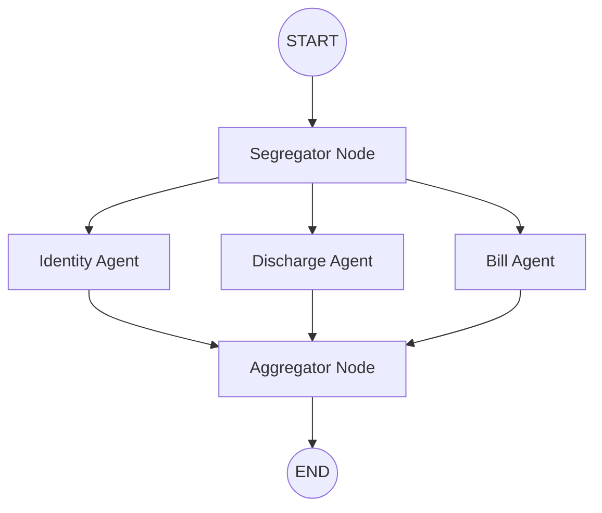

# Document Processing Pipeline

This project implements an intelligent document processing pipeline designed to handle medical claim documents. It uses **LangGraph** for orchestration and **Gemini 2.0 Flash** for state-of-the-art vision and text extraction.

## 🏗️ Architecture Overview

The pipeline follows a **fan-out/fan-in** architectural pattern (also known as a "diamond" pattern):

1.  **Segregator (Fan-out)**: Analyzes each page of the input PDF using vision-language models to classify it into specific document types (e.g., Identity Document, Itemized Bill, Discharge Summary).
2.  **Specialist Agents (Parallel Execution)**: Based on the classifications, specialized tasks run in parallel to extract structured data from relevant pages.
3.  **Aggregator (Fan-in)**: Collects results from all parallel agents and produces a consolidated JSON output.

### Graph Visualization


## 📂 Project Structure

- **`graph/`**: The core logic of the LangGraph pipeline.
    - [`state.py`](file:///c:/Users/athar/Desktop/Assignments/document-pipeline/graph/state.py): Defines the `PipelineState` schema and Pydantic models for structured output.
    - [`nodes.py`](file:///c:/Users/athar/Desktop/Assignments/document-pipeline/graph/nodes.py): Logic for each node (Segregator, ID Agent, Bill Agent, etc.). Uses asynchronous calls for performance.
    - [`workflow.py`](file:///c:/Users/athar/Desktop/Assignments/document-pipeline/graph/workflow.py): Connects the nodes into a compiled graph.
- **`utils/`**: Helper functions.
    - [`pdf_processing.py`](file:///c:/Users/athar/Desktop/Assignments/document-pipeline/utils/pdf_processing.py): Handles PDF-to-image conversion and text extraction using `pdf2image` and `PyMuPDF`.
- **`test_pipeline.py`**: The main entry point to run the pipeline on a local PDF file.
- **`test_graph_mocked.py`**: Unit tests using mocked LLM responses to verify graph transitions.
- **`verify_pdf.py`**: Diagnostic script to check if PDF pages are correctly converted to images.

## 🚀 Key Features

- **Multi-Modal Processing**: Uses Gemini's vision capabilities to "see" documents, which is more robust than traditional OCR for handwritten or complex layouts.
- **Structured Output**: Every agent returns strictly typed data using Pydantic, ensuring type safety and easy integration with downstream systems.
- **Parallelism**: Specialist agents run concurrently to minimize total processing time.
- **Error Resilience**: Each node includes try-except blocks that capture errors into the state without crashing the entire pipeline.
- **Math Verification**: The `BillAgent` automatically cross-checks itemized costs against the stated total using a Pydantic `model_validator`.

## 🛠️ Getting Started

1.  **Install Dependencies**:
    ```bash
    pip install -r requirements.txt
    ```
    *Note: requires `poppler` for PDF-to-image conversion.*

2.  **Environment Setup**:
    Create a `.env` file with your Google AI API Key:
    ```env
    GOOGLE_API_KEY=your_key_here
    ```

3.  **Run the Pipeline**:
    ```bash
    python test_pipeline.py
    ```

## 📑 Document Types Supported

The Segregator currently recognizes:
- `claim_forms`
- `cheque_or_bank_details`
- `identity_document`
- `itemized_bill`
- `discharge_summary`
- `prescription`
- `investigation_report`
- `cash_receipt`
- `other`
